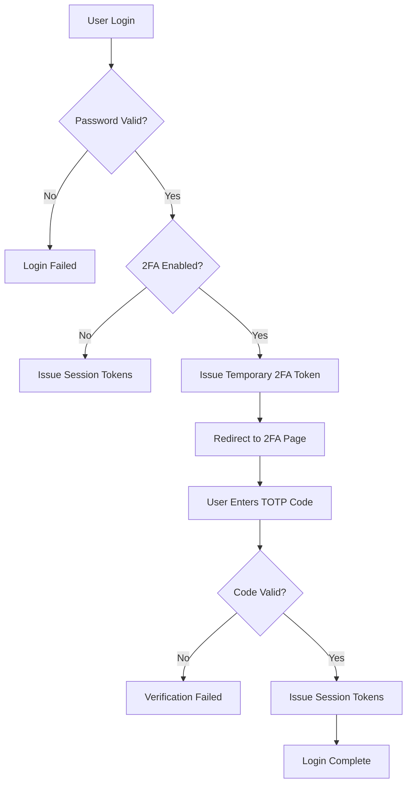

# I Built Complete 2FA (TOTP) in Node.js + Angular - Here's the Full Implementation

You've built a great authentication system. But is it secure enough? Two-Factor Authentication (2FA) using Time-Based One-Time Passwords (TOTP) adds a critical security layer that protects your users even if their password gets compromised. In this comprehensive guide, I'll show you exactly how I implemented production-ready 2FA in a full-stack application using Node.js, Express, Angular, and industry-standard tools.

**By the end of this tutorial, you'll have:**
- A complete backend 2FA system using Speakeasy and JWT
- An Angular frontend with QR code generation for authenticator apps
- Seamless integration with your existing authentication flow
- Production-grade security with temporary tokens and session management

**Last Updated:** November 2025  
**Tested with:** Node.js 20, Angular 20, Speakeasy 2.0, PostgreSQL 16

---

## What We're Building: A Complete 2FA Flow

Before diving into code, let's understand what we're creating. Our 2FA implementation follows the industry-standard TOTP (Time-Based One-Time Password) protocol, which is what apps like Google Authenticator and Authy use.

### The User Journey

**Enabling 2FA:**
1. User toggles 2FA in their profile settings
2. Backend generates a secret key
3. Frontend displays a QR code
4. User scans QR code with authenticator app
5. User enters 6-digit code to verify setup
6. 2FA is enabled and secret is stored

**Logging In with 2FA:**
1. User enters email and password
2. Backend validates credentials
3. If 2FA is enabled, backend issues temporary 2FA token (5-minute expiry)
4. Frontend redirects to 2FA verification page
5. User enters 6-digit code from authenticator app
6. Backend verifies code and issues full session tokens
7. User is logged in

### Architecture Overview



**Key Design Decisions:**
- **Temporary 2FA tokens** prevent replay attacks (5-minute expiry)
- **Separate 2FA cookie** isolates pre-login state from authenticated sessions
- **Window of 1** in TOTP verification allows for slight clock drift while maintaining security
- **Token version increment** invalidates all existing sessions when 2FA is enabled/disabled

---

## Prerequisites

Before we start, make sure you have:

### Required Tools
- **Node.js 18+** and **npm** installed
- **PostgreSQL** database running
- **Angular 17+** (this tutorial uses Angular 20)
- Existing authentication system (or follow along to build one)

### Required Packages

**Backend:**
```bash
npm install speakeasy @types/speakeasy jsonwebtoken @types/jsonwebtoken
npm install express cookie-parser @prisma/client
```

**Frontend:**
```bash
npm install angularx-qrcode
```

### Required Accounts
- No third-party services needed! TOTP is completely self-contained.
- (Optional) A smartphone with Google Authenticator, Authy, or Microsoft Authenticator for testing

**Note:** This tutorial assumes you already have basic JWT authentication set up with access and refresh tokens. If you don't, check out the prerequisite guide on JWT authentication first.

---

## Part 1: Database Schema

First, let's add the necessary fields to store 2FA information.

### Prisma Schema Updates

Add these fields to your `User` model in `schema.prisma`:

```prisma
model User {
  id               String    @id @default(cuid())
  email            String    @unique
  password         String?
  name             String?
  emailVerified    Boolean   @default(false)
  tokenVersion     Int       @default(0)
  
  // 2FA fields
  twoFactorEnabled Boolean   @default(false)
  twoFactorSecret  String?   // Stores the base32-encoded secret
  
  // ... other fields
}
```

**Why these fields?**
- `twoFactorEnabled`: Boolean flag to quickly check if user has 2FA active
- `twoFactorSecret`: Stores the TOTP secret key (base32-encoded for compatibility with authenticator apps)
- `tokenVersion`: Incremented when 2FA is enabled/disabled to invalidate all existing sessions (important for security!)

### Migration

Run the migration:

```bash
cd backend
npx prisma migrate dev --name add_2fa_fields
npx prisma generate
```

---

## Part 2: Backend - JWT Token Types

Before implementing the controllers, we need to define a special JWT token type for 2FA pre-authentication.

### JWT Utilities (`backend/src/utils/jwt.ts`)

Add the 2FA token secret and types:

```typescript
import jwt, { Secret, SignOptions } from 'jsonwebtoken';

// JWT Secrets
const ACCESS_SECRET: Secret = process.env.JWT_ACCESS_SECRET as Secret;
const REFRESH_SECRET: Secret = process.env.JWT_REFRESH_SECRET as Secret;
const TWOFA_SECRET: Secret = (process.env.JWT_2FA_SECRET || 'change_me_2fa') as Secret;

// JWT Expiry Times
const ACCESS_EXPIRES: SignOptions['expiresIn'] = '15m';
const REFRESH_EXPIRES: SignOptions['expiresIn'] = '7d';
const TWOFA_EXPIRES: SignOptions['expiresIn'] = '5m'; // Short-lived for security

// Token payload types
export type AccessPayload = { sub: string };
export type RefreshPayload = { sub: string; tv: number };
export type TwoFAPayload = { sub: string; n: string; type: 'twofa' }; // 'n' is nonce for uniqueness

// Sign 2FA token (issued after valid password, before TOTP verification)
export function signTwoFAToken(userId: string, nonce: string) {
  return jwt.sign(
    { sub: userId, n: nonce, type: 'twofa' } as TwoFAPayload,
    TWOFA_SECRET,
    { expiresIn: TWOFA_EXPIRES }
  );
}

// Verify 2FA token
export function verifyTwoFAToken(token: string): TwoFAPayload {
  const payload = jwt.verify(token, TWOFA_SECRET) as TwoFAPayload;
  if (payload.type !== 'twofa') {
    throw new Error('Invalid token type');
  }
  return payload;
}

// Access and Refresh token functions (you should already have these)
export function signAccessToken(userId: string) {
  return jwt.sign({ sub: userId } as AccessPayload, ACCESS_SECRET, { expiresIn: ACCESS_EXPIRES });
}

export function signRefreshToken(userId: string, tokenVersion: number) {
  return jwt.sign({ sub: userId, tv: tokenVersion } as RefreshPayload, REFRESH_SECRET, {
    expiresIn: REFRESH_EXPIRES,
  });
}
```

**Key Security Features:**
- **5-minute expiry** on 2FA tokens prevents prolonged exposure
- **Nonce (`n`)** ensures each 2FA token is unique, preventing replay attacks
- **Type validation** ensures tokens can't be confused with other JWT types
- **Separate secret** isolates 2FA tokens from your main authentication system

### Constants (`backend/src/utils/constants.ts`)

Define the cookie name:

```typescript
export const TWOFA_COOKIE = process.env.TWOFA_COOKIE || 'twofa_token';
export const ACCESS_TOKEN_COOKIE = process.env.ACCESS_TOKEN_COOKIE || 'access_token';
export const REFRESH_TOKEN_COOKIE = process.env.REFRESH_TOKEN_COOKIE || 'refresh_token';
export const IS_PROD = process.env.NODE_ENV === 'production';
```

---

## Part 3: Backend - 2FA Controller

Now let's implement the core 2FA functionality. This is the heart of our implementation.

### Create the Controller (`backend/src/controllers/twofaController.ts`)

```typescript
import { Request, Response, NextFunction } from 'express';
import speakeasy from 'speakeasy';
import { randomUUID } from 'crypto';
import { prisma } from '../prisma';
import {
  IS_PROD,
  TWOFA_COOKIE,
  ACCESS_TOKEN_COOKIE,
  REFRESH_TOKEN_COOKIE,
} from '../utils/constants';
import { verifyTwoFAToken, signAccessToken, signRefreshToken } from '../utils/jwt';

// 1. Generate a TOTP secret and otpauth URL
export async function twofaSetup(req: Request, res: Response, next: NextFunction) {
  try {
    const userId = req.userId!; // From your auth middleware
    const user = await prisma.user.findUnique({
      where: { id: userId },
      select: { id: true, email: true },
    });
    if (!user) return res.status(404).json({ message: 'User not found' });

    // Generate TOTP secret
    const label = `YourAppName:${user.email}`; // This appears in authenticator apps
    const secret = speakeasy.generateSecret({ name: label });

    // Return secret base32 and otpauth URL for QR code generation
    return res.json({
      secret: secret.base32,
      otpauthUrl: secret.otpauth_url,
    });
  } catch (err) {
    next(err);
  }
}

// 2. Get current 2FA status
export async function twofaStatus(req: Request, res: Response, next: NextFunction) {
  try {
    const user = await prisma.user.findUnique({
      where: { id: req.userId! },
      select: { twoFactorEnabled: true },
    });
    const enabled = !!user?.twoFactorEnabled;
    res.json({ enabled });
  } catch (err) {
    next(err);
  }
}

// 3. Verify TOTP code and enable 2FA
export async function twofaEnable(req: Request, res: Response, next: NextFunction) {
  try {
    const userId = req.userId!;
    const { secret, token } = req.body as { secret: string; token: string };
    
    if (!secret || !token) {
      return res.status(400).json({ message: 'secret and token are required' });
    }

    // Verify the TOTP code against the secret
    const ok = speakeasy.totp.verify({
      secret,
      encoding: 'base32',
      token,
      window: 1, // Allows 30-second time drift
    });
    
    if (!ok) {
      return res.status(400).json({ message: 'Invalid 2FA token' });
    }

    // Save the secret and enable 2FA
    await prisma.user.update({
      where: { id: userId },
      data: {
        twoFactorEnabled: true,
        twoFactorSecret: secret,
        tokenVersion: { increment: 1 }, // Invalidate all existing sessions
      },
    });
    
    return res.json({ message: '2FA enabled successfully' });
  } catch (err) {
    next(err);
  }
}

// 4. Disable 2FA
export async function twofaDisable(req: Request, res: Response, next: NextFunction) {
  try {
    const userId = req.userId!;
    
    await prisma.user.update({
      where: { id: userId },
      data: {
        twoFactorEnabled: false,
        twoFactorSecret: null,
        tokenVersion: { increment: 1 }, // Invalidate all existing sessions
      },
    });
    
    return res.json({ message: '2FA disabled successfully' });
  } catch (err) {
    next(err);
  }
}

// 5. Verify 2FA code during login (MOST IMPORTANT FUNCTION)
export async function twofaVerifyLogin(req: Request, res: Response, next: NextFunction) {
  try {
    const code = (req.body as { code: string }).code;
    if (!code) {
      return res.status(400).json({ message: 'code is required' });
    }

    // Get the temporary 2FA token from cookie
    const token = req.cookies?.[TWOFA_COOKIE];
    if (!token) {
      return res.status(401).json({ message: '2FA session expired' });
    }

    // Verify the temporary 2FA token
    let payload;
    try {
      payload = verifyTwoFAToken(token);
    } catch {
      return res.status(401).json({ message: '2FA session expired' });
    }

    // Get user with 2FA secret
    const user = await prisma.user.findUnique({
      where: { id: payload.sub },
      select: {
        id: true,
        twoFactorEnabled: true,
        twoFactorSecret: true,
        tokenVersion: true,
      },
    });
    
    if (!user || !user.twoFactorEnabled || !user.twoFactorSecret) {
      return res.status(401).json({ message: '2FA not enabled' });
    }

    // Verify the TOTP code
    const ok = speakeasy.totp.verify({
      secret: user.twoFactorSecret,
      encoding: 'base32',
      token: code,
      window: 1,
    });
    
    if (!ok) {
      return res.status(400).json({ message: 'Invalid 2FA code' });
    }

    // TOTP verified! Issue full session tokens
    const access = signAccessToken(user.id);
    const refresh = signRefreshToken(user.id, user.tokenVersion);
    
    const cookieOpts = {
      httpOnly: true,
      secure: IS_PROD,
      sameSite: IS_PROD ? ('none' as const) : ('lax' as const),
      path: '/',
    };
    
    res.cookie(ACCESS_TOKEN_COOKIE, access, {
      ...cookieOpts,
      maxAge: 15 * 60 * 1000, // 15 minutes
    });
    
    res.cookie(REFRESH_TOKEN_COOKIE, refresh, {
      ...cookieOpts,
      maxAge: 7 * 24 * 60 * 60 * 1000, // 7 days
    });

    // Clear the temporary 2FA token
    res.clearCookie(TWOFA_COOKIE, cookieOpts);

    return res.json({ message: '2FA verified successfully' });
  } catch (err) {
    next(err);
  }
}
```

**Why This Works:**

1. **twofaSetup**: Generates a unique TOTP secret using Speakeasy. The `otpauth_url` is specially formatted for QR codes.

2. **twofaEnable**: Verifies user has the correct secret by asking for a TOTP code. The `window: 1` parameter allows for a 30-second time drift (important for real-world usage where clocks might be slightly out of sync).

3. **twofaVerifyLogin**: This is the critical security checkpoint. It verifies the temporary 2FA token (proving password was correct), then verifies the TOTP code (proving user has their device), and only then issues full session tokens.

4. **Token version increment**: When enabling/disabling 2FA, we increment `tokenVersion`. This invalidates all existing refresh tokens, forcing users to re-authenticate.

---

## Part 4: Backend Routes and Login Integration

### Add Routes (`backend/src/routes/authRoutes.ts`)

```typescript
import { Router } from 'express';
import { requireAuth } from '../middleware/requireAuth';
import { twofaSetup, twofaEnable, twofaDisable, twofaVerifyLogin, twofaStatus } from '../controllers/twofaController';

const router = Router();

router.post('/2fa/setup', requireAuth, twofaSetup);
router.post('/2fa/enable', requireAuth, twofaEnable);
router.post('/2fa/disable', requireAuth, twofaDisable);
router.get('/2fa/status', requireAuth, twofaStatus);
router.post('/2fa/verify-login', twofaVerifyLogin); // NO requireAuth - uses temporary token

export default router;
```

### Modify Login to Check 2FA

```typescript
import { randomUUID } from 'crypto';

export async function login(req: Request, res: Response, next: any) {
  try {
    const { email, password } = req.body;
    const user = await validateUser(email, password);
    if (!user) return res.status(401).json({ message: 'Invalid credentials' });

    const dbUser = await prisma.user.findUnique({
      where: { id: user.id },
      select: { id: true, emailVerified: true, tokenVersion: true, twoFactorEnabled: true },
    });

    if (!dbUser.emailVerified) {
      return res.status(403).json({ message: 'Please verify your email' });
    }

    // Check for 2FA
    if (dbUser.twoFactorEnabled) {
      const nonce = randomUUID();
      const twofaToken = signTwoFAToken(user.id, nonce);
      res.cookie(TWOFA_COOKIE, twofaToken, {
        httpOnly: true, secure: IS_PROD, sameSite: IS_PROD ? 'none' : 'lax',
        maxAge: 5 * 60 * 1000, path: '/',
      });
      return res.json({ requires2FA: true });
    }

    // Normal login
    const access = signAccessToken(user.id);
    const refresh = signRefreshToken(user.id, dbUser.tokenVersion);
    res.cookie(ACCESS_TOKEN_COOKIE, access, { /* opts */ });
    res.cookie(REFRESH_TOKEN_COOKIE, refresh, { /* opts */ });
    return res.json({ message: 'Login successful', user });
  } catch (err) {
    next(err);
  }
}
```

---

## Part 5: Frontend Service

### Auth Service (`frontend/src/app/services/auth.service.ts`)

```typescript
@Injectable({ providedIn: 'root' })
export class AuthService {
  private http = inject(HttpClient);
  private base = environment.apiUrl + '/auth';
  private _isAuthenticated$ = new BehaviorSubject<boolean>(false);
  isAuthenticated$ = this._isAuthenticated$.asObservable();
  
  login(data: { email: string; password: string }): Observable<any> {
    return this.http.post<any>(`${this.base}/login`, data, { withCredentials: true }).pipe(
      tap((resp: any) => {
        this._isAuthenticated$.next(resp && !resp.requires2FA);
      })
    );
  }

  twofaVerify(code: string): Observable<{ message: string }> {
    return this.http.post<{ message: string }>(`${this.base}/2fa/verify-login`, { code }, { withCredentials: true }).pipe(
      tap(() => this._isAuthenticated$.next(true))
    );
  }

  twofaSetup(): Observable<{ secret: string; otpauthUrl: string }> {
    return this.http.post<{ secret: string; otpauthUrl: string }>(`${this.base}/2fa/setup`, {}, { withCredentials: true });
  }

  twofaEnable(secret: string, token: string): Observable<{ message: string }> {
    return this.http.post<{ message: string }>(`${this.base}/2fa/enable`, { secret, token }, { withCredentials: true });
  }

  twofaDisable(): Observable<{ message: string }> {
    return this.http.post<{ message: string }>(`${this.base}/2fa/disable`, {}, { withCredentials: true });
  }

  twofaStatus(): Observable<{ enabled: boolean }> {
    return this.http.get<{ enabled: boolean }>(`${this.base}/2fa/status`, { withCredentials: true });
  }
}
```

---

## Part 6: Frontend - 2FA Verification Page

```typescript
@Component({
  selector: 'app-two-factor',
  standalone: true,
  imports: [CommonModule, ReactiveFormsModule, RouterLink],
  template: `
    <div class="login_content">
      <h2>Two-Factor Authentication</h2>
      <p>Enter the 6-digit code from your authenticator app.</p>
      <form [formGroup]="form" (ngSubmit)="onSubmit()">
        <input type="text" formControlName="code" placeholder="000000" maxlength="6" autocomplete="one-time-code" autofocus />
        <button type="submit" [disabled]="form.invalid || loading">{{ loading ? 'Verifying...' : 'Verify' }}</button>
        <a routerLink="/login">Back to login</a>
        @if (errorMessage) { <div class="error">{{ errorMessage }}</div> }
      </form>
    </div>
  `
})
export class TwoFactorPage {
  private auth = inject(AuthService);
  private router = inject(Router);
  form = inject(FormBuilder).group({ code: ['', [Validators.required, Validators.pattern(/^\d{6}$/)]] });
  loading = false;
  errorMessage = '';

  onSubmit() {
    if (this.form.invalid) return;
    this.loading = true;
    this.auth.twofaVerify(this.form.value.code!).subscribe({
      next: () => this.router.navigate(['/dashboard']),
      error: (e) => { this.errorMessage = e?.error?.message || 'Invalid code'; this.form.reset(); },
      complete: () => this.loading = false
    });
  }
}
```

---

## Part 7: Frontend - Profile 2FA Setup

Install QR library:
```bash
npm install angularx-qrcode
```

### Profile Component

```typescript
@Component({
  selector: 'app-profile',
  standalone: true,
  imports: [CommonModule, ReactiveFormsModule, QRCodeComponent],
  templateUrl: './profile.page.html'
})
export class ProfilePage implements OnInit {
  private auth = inject(AuthService);
  twoFactorEnabled = false;
  setupSecret: string | null = null;
  otpauthUrl: string | null = null;
  twofaForm = inject(FormBuilder).group({ code: ['', [Validators.required, Validators.pattern(/^\d{6}$/)]] });

  ngOnInit() { this.refreshStatus(); }

  refreshStatus() {
    this.auth.twofaStatus().subscribe(({ enabled }) => this.twoFactorEnabled = enabled);
  }

  start2FASetup() {
    this.auth.twofaSetup().subscribe({
      next: ({ secret, otpauthUrl }) => { this.setupSecret = secret; this.otpauthUrl = otpauthUrl; },
      error: () => alert('Setup failed')
    });
  }

  confirm2FAEnable() {
    if (!this.setupSecret) return;
    this.auth.twofaEnable(this.setupSecret, this.twofaForm.value.code!).subscribe({
      next: () => { alert('2FA enabled!'); this.cancel(); this.refreshStatus(); },
      error: (e) => alert(e?.error?.message || 'Failed')
    });
  }

  cancel() { this.setupSecret = null; this.otpauthUrl = null; this.twofaForm.reset(); this.refreshStatus(); }

  disable2FA() {
    if (!confirm('Disable 2FA?')) { this.twoFactorEnabled = true; return; }
    this.auth.twofaDisable().subscribe({ next: () => { alert('Disabled'); this.cancel(); } });
  }
}
```

### Template (`profile.page.html`)

```html
<h3>Two-Factor Authentication</h3>
<label><input type="checkbox" [checked]="twoFactorEnabled" (change)="twoFactorEnabled ? disable2FA() : start2FASetup()" /> Enable 2FA</label>

@if (setupSecret && otpauthUrl) {
  <div class="setup">
    <qrcode [qrdata]="otpauthUrl" [width]="200"></qrcode>
    <p>Manual code: <code>{{ setupSecret }}</code></p>
    <form [formGroup]="twofaForm" (ngSubmit)="confirm2FAEnable()">
      <input type="text" formControlName="code" placeholder="000000" maxlength="6" />
      <button type="submit" [disabled]="twofaForm.invalid">Verify & Enable</button>
      <button type="button" (click)="cancel()">Cancel</button>
    </form>
  </div>
}
```

---

## Testing Checklist

- [ ] Enable 2FA from profile
- [ ] Scan QR with authenticator app
- [ ] Verify code and enable
- [ ] Logout and login
- [ ] Enter 2FA code successfully
- [ ] Try invalid code (should fail)
- [ ] Disable 2FA
- [ ] Login without 2FA prompt

---

## Troubleshooting

**Issue:** "Invalid 2FA code" with correct code  
**Fix:** Increase `window` parameter to 2 in `speakeasy.totp.verify()` for time drift

**Issue:** "2FA session expired"  
**Fix:** User exceeded 5 minutes. Increase JWT_2FA_EXPIRES or re-login

**Issue:** QR code not showing  
**Fix:** Verify QRCodeComponent import and otpauthUrl format

**Issue:** CORS with cookies  
**Fix:** Use `secure: false, sameSite: 'lax'` for localhost

---

## Security Best Practices

1. **Rate limit 2FA attempts** (5 attempts per 15 minutes)
2. **Log 2FA events** for audit trail
3. **Generate backup codes** when enabling 2FA
4. **Encrypt secrets at rest** in database
5. **Force 2FA for admin users**

---

## Conclusion

You now have production-ready 2FA with TOTP! Key features:
- Speakeasy for TOTP generation/verification
- Temporary JWT tokens for pre-auth state
- QR codes for easy setup
- Token version for session invalidation
- Seamless Angular integration

**Resources:**
- [Speakeasy Docs](https://github.com/speakeasyjs/speakeasy)
- [TOTP RFC 6238](https://tools.ietf.org/html/rfc6238)
- [angularx-qrcode](https://github.com/cordobo/angularx-qrcode)

---

> **Skip the boilerplate with StackInsight Auth Pro**  
> Want this full 2FA setup plus a production-ready auth stack? **StackInsight Auth Pro** is a complete Angular 20 SSR + httpOnly cookie starter with TOTP 2FA built in. It turns everything in this guide into a ready-to-run codebase so you can focus on your product, not the wiring.  
> Learn more at [stackinsight.app](https://stackinsight.app)
