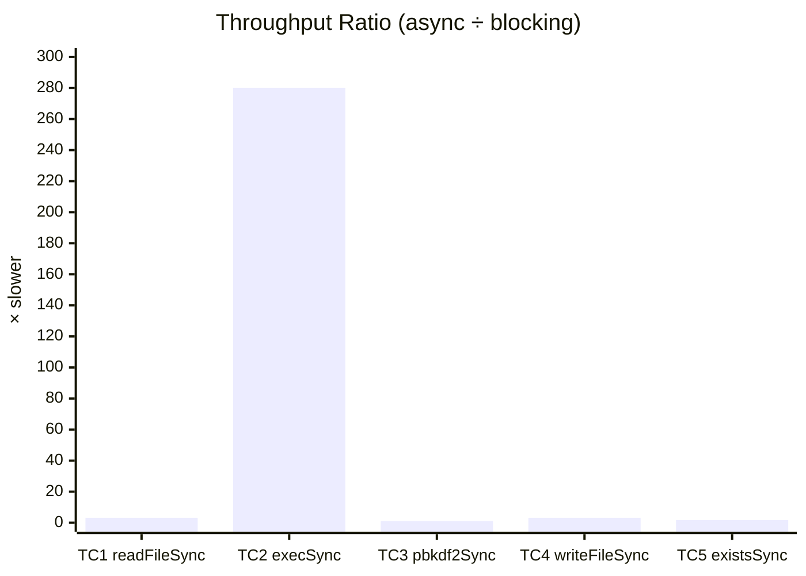

# We Scanned 250 Node.js Repos for Blocking I/O. 76% Had It.

There's a rule every Node.js developer learns early: don't block the event loop. It's in the docs, it's in every conference talk, it's probably written on a sticky note somewhere on your monitor.

So I got curious. How many codebases actually follow that rule?

I wrote a static analysis tool, pointed it at 250 public Node.js repositories — frameworks, CMS platforms, API servers, CLI tools, the works — and counted every synchronous I/O call. Then I built five Express servers that deliberately use blocking patterns, put them under load with 100 concurrent connections, and measured what happens.

The short version: 76% of repos have blocking I/O somewhere. Most of it is harmless — startup code, test files, build scripts. But about 7% sits in request-handling code paths. And the benchmarks show exactly why that 7% matters: `execSync` in a handler drops your throughput from 10,000 requests per second to 36. `pbkdf2Sync` causes timeouts and errors that the async version completely avoids.

Here's the full breakdown.

> **30-minute action plan for engineering leads:** Run `grep -rn "Sync(" src/ --include="*.ts" --include="*.js" | grep -v node_modules | grep -v test` on your server codebase. Any hits in route handlers or middleware are immediate priorities — especially `execSync` (280× throughput penalty) and `pbkdf2Sync` (causes cascading timeouts). Swap each for its async counterpart and `await` the result. Then add `perf_hooks.monitorEventLoopDelay()` to your production monitoring — if P99 stays above 50ms, you still have blocking somewhere. The fixes are usually one-line changes; the performance gains are measured in orders of magnitude.

---

## What "blocking" actually means in Node.js

Node.js runs your JavaScript on a single thread. One event loop, one call stack. When you call `fs.readFileSync()`, that thread stops doing everything else until the file read completes. No new requests get handled. No callbacks fire. No timers execute. The entire server just... waits.

For a CLI tool or a build script, that's fine. You're the only user and you're waiting for the result anyway.

But inside a request handler serving 100 concurrent users? That file read blocks *all 100* of them. Each one has to wait their turn. Latency stacks up linearly with concurrency.

The async alternative — `fs.readFile()` or `fs.promises.readFile()` — hands the work to a thread pool and lets the event loop keep processing other requests while the I/O completes in the background. Same result, no queue.

The question isn't whether blocking is bad. It's *how bad*, and *how often* it shows up in real code.

---

## Part 1: How common is blocking I/O in the wild?

### How I ran the scan

I built an AST-based detector (adapted from [Code Evolution Lab](https://codeevolutionlab.com)) that parses JavaScript and TypeScript files with Babel and walks the syntax tree looking for synchronous calls from four module families:

| Module | What it catches | Examples |
|--------|----------------|----------|
| `fs` | Synchronous file operations | `readFileSync`, `writeFileSync`, `existsSync`, `statSync` |
| `child_process` | Synchronous process spawning | `execSync`, `spawnSync`, `execFileSync` |
| `crypto` | Synchronous cryptographic ops | `pbkdf2Sync`, `scryptSync`, `randomFillSync` |
| `zlib` | Synchronous compression | `gzipSync`, `deflateSync`, `brotliCompressSync` |

For each hit, the detector classifies *where* in the code it appears using ancestor analysis and file path heuristics:

- **request_path** — inside an Express/Koa/Fastify route handler or middleware
- **startup_path** — module-level initialization, constructor, top-level code
- **tooling_path** — test files, build scripts, migrations, seeds
- **background_path** — timer callbacks, event listeners, promise chains
- **unknown_path** — couldn't determine from static analysis alone

I ran this against 250 repos. Everything from Express and Next.js to Strapi, n8n, and Redwood.

### The numbers

**187,251 files scanned. 10,609 blocking calls found. 191 out of 250 repos had at least one.**

That's a **76.4% prevalence rate**.

Here's how the calls break down by type:

| Category | Count | Share |
|----------|-------|-------|
| Sync file operations (`fs`) | 9,608 | 90.6% |
| Sync child process | 902 | 8.5% |
| Sync compression (`zlib`) | 59 | 0.6% |
| Sync crypto | 40 | 0.4% |

File system calls dominate. Nine out of ten blocking I/O instances are `fs.*Sync` methods.

### Which specific calls?

The top ten, by frequency:

| Method | Count |
|--------|-------|
| `existsSync` | 2,588 |
| `readFileSync` | 2,405 |
| `writeFileSync` | 1,542 |
| `execSync` | 659 |
| `mkdirSync` | 654 |
| `readdirSync` | 633 |
| `statSync` | 397 |
| `unlinkSync` | 258 |
| `copyFileSync` | 194 |
| `lstatSync` | 145 |

`existsSync` is the single most common blocking call in the Node.js ecosystem. Makes sense — checking if a file exists is such a quick, "harmless" operation that developers reach for the sync version without thinking. And usually, it *is* harmless. Until it isn't.

### Where does the blocking code live?

This is the more interesting question. Finding `readFileSync` in a test file is very different from finding it in an Express route handler.

| Context | Count | Share |
|---------|-------|-------|
| Tooling / test files | 2,035 | 19.2% |
| Startup / initialization | 1,310 | 12.4% |
| **Request handling** | **716** | **6.8%** |
| Background (timers, listeners) | 149 | 1.4% |
| Unknown (unclassified) | 6,399 | 60.3% |

The unknown bucket is large because static analysis can only see so much. Without runtime tracing, you can't always tell if a function is called from a route handler or from a startup script. But the 6.8% that we *can* confidently place in request paths — that's 716 blocking calls sitting directly in the hot path, across some very well-known projects.

That 6.8% is a **lower bound**. The 6,399 unknowns could shift the picture significantly. Here's a quick sensitivity analysis:

| If X% of unknowns are request-path | Estimated request-path total | Share of all findings |
|-------------------------------------|-----------------------------|-----------------------|
| 0% (current confirmed) | 716 | 6.8% |
| 5% | 1,036 | 9.8% |
| 10% | 1,356 | 12.8% |
| 25% | 2,316 | 21.8% |

Even a conservative 5% assumption pushes the estimate close to 10%. The true number is unknowable without runtime tracing, but the range gives you a sense of worst-case exposure. If your codebase has blocking calls that the detector couldn't classify, assume they're guilty until proven innocent.

And tooling plus startup accounts for 31.5%. Those are generally fine. A `readFileSync` in your webpack config or in a `beforeAll()` test hook isn't going to hurt anyone.

### The biggest offenders

| Repository | Blocking calls |
|------------|---------------|
| redwoodjs/redwood | 747 |
| yarnpkg/berry | 583 |
| vercel/next.js | 515 |
| atom/atom | 435 |
| n8n-io/n8n | 429 |
| gatsbyjs/gatsby | 326 |
| babel/babel | 318 |
| evanw/esbuild | 259 |
| payloadcms/payload | 240 |
| Budibase/budibase | 217 |

Before you get alarmed — raw count doesn't mean raw risk. Yarn Berry and Babel are build tools. Their blocking calls run in CLI context, not in a server. esbuild is a bundler. Atom is a desktop app.

But n8n is a workflow automation server. Payload is a CMS with an API layer. Strapi (174 calls, further down the list) is a headless CMS serving HTTP requests. Those are the ones where blocking I/O in the wrong place actually hurts real users.

### What the severity breakdown tells us

I assigned severity based on context:

| Severity | Count | What it means |
|----------|-------|---------------|
| Critical | 99 | Blocking call inside a loop, inside a request handler |
| High | 1,697 | In a request handler or inside a loop |
| Medium | 5,468 | Unknown context — can't rule out request path |
| Low | 3,345 | Startup, tooling, or background — generally safe |

For reproducibility, here are the exact classification rules the detector applies (in precedence order):

| Severity | Rule |
|----------|------|
| **Critical** | `context = request_path` AND `inLoop = true` |
| **High** | `context = request_path`, OR `context = background_path` AND `inLoop`, OR `context = unknown_path` AND `inLoop` |
| **Medium** | `context = background_path`, OR `context = unknown_path` (no loop) |
| **Low** | `context = startup_path`, OR `context = tooling_path` |

Context itself is determined by a deterministic precedence chain: tooling file path → AST request-handler detection → request-path file hint → background callbacks (timers, listeners, promises) → startup/init patterns → unknown. The detector checks both AST ancestor analysis (e.g., is this call inside a function passed to `app.get()`?) and file-path heuristics (e.g., does the path contain `/routes/`, `/middleware/`, `/test/`, `/scripts/`?).

99 critical findings. That's blocking I/O, in a loop, in a request handler. Each one is a latency multiplier under concurrent load. The kind of thing that works fine in development with one user and explodes in production with fifty.

---

## Part 2: What does blocking I/O actually cost?

Numbers from a scan are one thing. Knowing that `readFileSync` exists in 2,405 places doesn't tell you how much it hurts. So I built five benchmark scenarios and measured them.

### The setup

Each scenario has two Express servers: a "bad" one that uses the synchronous call and a "good" one that does the same work asynchronously. Same logic, same response, different I/O strategy.

I hit each server with [autocannon](https://github.com/mcollina/autocannon) — 100 concurrent connections for 20 seconds. That's enough to saturate the event loop and reveal the blocking penalty.

**Environment:** Node.js v24.11.0, Windows x64, everything running locally.

### TC1: readFileSync in a request handler

The textbook example. The bad server reads a config file synchronously on every request. The good server uses `fs.promises.readFile` and caches the result.

| Metric | Blocking | Async | Difference |
|--------|----------|-------|------------|
| **Throughput** | 3,066 req/s | 9,826 req/s | **3.2x** |
| **P50 latency** | 32ms | 9ms | 3.6x |
| **P95 latency** | 39ms | 13ms | 3.0x |
| **P99 latency** | 43ms | 14ms | 3.1x |
| **Event loop delay (avg)** | 16.4ms | 11.5ms | 1.4x |
| **Event loop delay (max)** | 61.9ms | 23.5ms | 2.6x |
| **Errors** | 0 | 0 | — |

A 3.2x throughput drop from a single `readFileSync` call. Not catastrophic, but significant. At 100 concurrent connections, you're serving 6,760 fewer requests over a 20-second window. Scale that to a day of traffic and it adds up.

The latency numbers tell the story more clearly. Every request in the blocking version takes at least 32ms at the median — that's time spent waiting in the event loop queue behind other file reads. The async version keeps the median at 9ms because the event loop stays free to pick up the next request immediately.

### TC2: execSync in a request handler

This is the scary one. The bad server runs a shell command synchronously — simulating something like `execSync('git log --oneline')` or `execSync('convert image.png ...')` that sometimes shows up in webhook handlers or admin endpoints.

| Metric | Blocking | Async | Difference |
|--------|----------|-------|------------|
| **Throughput** | 36 req/s | 10,000 req/s | **280x** |
| **P50 latency** | 6,725ms | 8ms | 841x |
| **P95 latency** | 16,177ms | 12ms | 1,348x |
| **Avg latency** | 9,014ms | 10ms | 901x |
| **Event loop delay (avg)** | 3,821ms | 14ms | 273x |
| **Event loop delay (max)** | 6,451ms | 1,359ms | 4.7x |
| **Errors** | 64 | 0 | — |

**280x throughput difference.** From ten thousand requests per second to thirty-six.

The blocking version's median latency is 6.7 *seconds*. P95 is over 16 seconds. And 64 requests errored out entirely — the event loop was so jammed that connections timed out or the OS rejected them.

The async version? 8ms median, zero errors, 10,000 req/s. Same work, same shell command, but executed with `execFile` (async) so the event loop stays responsive.

`execSync` is the single most destructive blocking call you can put in a request handler. It spawns a child process *and* blocks the parent until it finishes. Every other connection queues behind it. Under real concurrent load, your server effectively becomes single-user.

### TC3: pbkdf2Sync in authentication

Password hashing on a login endpoint. The bad server uses `crypto.pbkdf2Sync` with 1,000,000 iterations. The good server uses the async `crypto.pbkdf2` (promisified), which offloads the CPU work to the thread pool.

| Metric | Blocking | Async | Difference |
|--------|----------|-------|------------|
| **Throughput** | 17 req/s | 18 req/s | ~1.1x |
| **P50 latency** | 13,027ms | 5,653ms | 2.3x |
| **P95 latency** | 13,028ms | 5,802ms | 2.2x |
| **Avg latency** | 10,924ms | 4,918ms | 2.2x |
| **Event loop delay (avg)** | 4,744ms | 15.5ms | **306x** |
| **Event loop delay (max)** | 9,488ms | 24.6ms | **386x** |
| **Errors** | 91 | 0 | — |
| **Timeouts** | 26 | 0 | — |

The throughput numbers look deceptively similar — both are processing roughly 17-18 requests per second. That's because the actual CPU work (1M PBKDF2 iterations) takes about the same time either way. You can't speed up the math.

But look at everything else.

The blocking version caused **91 errors and 26 timeouts**. The async version: zero. The event loop delay is the tell — 4,744ms average in the blocking case versus 15.5ms for async. That's a **306x difference** in how responsive the server is to other work. While `pbkdf2Sync` is grinding through a hash, nothing else moves. No health checks, no other routes, no keepalive pings. With the async version, the hash runs on the thread pool and the event loop stays free.

This is the pattern that takes down production servers during login spikes. The CPU work is unavoidable — you need the hash. But blocking the event loop with it is a choice, and it's the wrong one.

**A note on security:** `pbkdf2Sync` in a request handler isn't just a performance bug — it's a **DoS amplifier**. An attacker doesn't need to find a vulnerability; they just need to send a burst of login requests. Each one locks the event loop for seconds, starving every other connection. The async version doesn't eliminate the CPU cost, but it keeps the server responsive enough to enforce rate limits, respond to health checks, and shed excess load. If you're running CPU-bound crypto on an auth endpoint, pair the async call with request rate-limiting and consider offloading to a worker thread pool or a dedicated queue for sustained spikes.

### TC4: writeFileSync in a request handler

Logging, audit trails, file uploads — writing data to disk in a handler is common. The bad server uses `writeFileSync`. The good server uses `fs.promises.writeFile`.

| Metric | Blocking | Async | Difference |
|--------|----------|-------|------------|
| **Throughput** | 3,169 req/s | 10,185 req/s | **3.2x** |
| **P50 latency** | 29ms | 9ms | 3.2x |
| **P95 latency** | 40ms | 13ms | 3.1x |
| **P99 latency** | 44ms | 14ms | 3.1x |
| **Event loop delay (avg)** | 15.9ms | 12.2ms | 1.3x |
| **Event loop delay (max)** | 49ms | 19.9ms | 2.5x |
| **Errors** | 0 | 0 | — |

Almost identical profile to TC1. 3.2x throughput hit, ~3x latency inflation across all percentiles. File writes and file reads block the event loop in roughly the same way — which makes sense, since both are I/O operations that wait on the OS kernel.

The event loop delay max (49ms vs 20ms) shows the spiky nature of writes — disk I/O can stall briefly on buffer flushes, and in the sync case, the entire server stalls with it.

### TC5: existsSync + statSync in a request handler

The subtlest one. The bad server checks if a file exists and reads its metadata synchronously — two blocking calls per request. The good server uses `fs.promises.access` and `fs.promises.stat` with in-memory caching.

| Metric | Blocking | Async + Cache | Difference |
|--------|----------|---------------|------------|
| **Throughput** | 5,966 req/s | 10,121 req/s | **1.7x** |
| **P50 latency** | 16ms | 9ms | 1.8x |
| **P95 latency** | 20ms | 13ms | 1.5x |
| **P99 latency** | 21ms | 13ms | 1.6x |
| **Event loop delay (avg)** | 16.3ms | 11.9ms | 1.4x |
| **Event loop delay (max)** | 21.3ms | 20.8ms | ~1.0x |
| **Errors** | 0 | 0 | — |

The smallest gap of all five scenarios. `existsSync` and `statSync` are fast operations — the kernel usually has file metadata cached, so the actual block time is tiny. You still lose 1.7x throughput, and the latency is nearly doubled, but it's not the catastrophe that `execSync` is.

That said, this is also the most *common* pattern. Remember: `existsSync` showed up 2,588 times in the scan — the single most frequent blocking call. A 1.7x penalty applied across thousands of codebases adds up to a lot of wasted capacity.

---

## The full picture

| Scenario | Bad Throughput | Good Throughput | Ratio | Bad P95 | Good P95 | Bad EL Max |
|----------|---------------|-----------------|-------|---------|----------|------------|
| TC1: readFileSync | 3,066 | 9,826 | **3.2x** | 39ms | 13ms | 62ms |
| TC2: execSync | 36 | 10,000 | **280x** | 16,177ms | 12ms | 6,451ms |
| TC3: pbkdf2Sync | 17 | 18 | ~1x* | 13,028ms | 5,802ms | 9,488ms |
| TC4: writeFileSync | 3,169 | 10,185 | **3.2x** | 40ms | 13ms | 49ms |
| TC5: existsSync+statSync | 5,966 | 10,121 | **1.7x** | 20ms | 13ms | 21ms |

*\*TC3 throughput is similar because the CPU work dominates — but the blocking version caused 91 errors and 26 timeouts, while the async version had zero.*

#### Throughput penalty by scenario (blocking vs async ratio)



> TC2's 280× bar dwarfs everything else — `execSync` in a handler is in a class of its own. TC3 looks mild by throughput alone, but caused 91 errors and 26 timeouts that the async version completely avoided.

#### Event loop max delay by scenario (ms)

```mermaid
xychart-beta
    title "Event Loop Max Delay (ms)"
    x-axis ["TC1", "TC2", "TC3", "TC4", "TC5"]
    y-axis "ms" 0 --> 10000
    bar [62, 6451, 9488, 49, 21]
    bar [24, 1359, 25, 20, 21]
```



> Orange = blocking, blue = async. TC3 (`pbkdf2Sync`) peaks at 9.5 seconds — the event loop is frozen solid while the hash computes. TC2 (`execSync`) hits 6.5 seconds. The async versions stay under 1.4 seconds even in the worst case.

A few patterns jump out.

**The severity spectrum is wide.** `existsSync` costs you 1.7x. `readFileSync` and `writeFileSync` cost 3.2x. `execSync` costs 280x. Not all blocking calls are created equal, and treating them as equally dangerous would be a mistake.

**Errors matter more than throughput for some patterns.** TC3's throughput is nearly identical between blocking and async, but the blocking version is *broken* — 91 errors, 26 timeouts, and event loop delays pushing 10 seconds. A throughput-only comparison would miss this entirely.

**Event loop delay is the canary.** In every scenario, the event loop delay metric showed the damage before latency percentiles did. If you're monitoring one thing, monitor that. Node.js gives you `perf_hooks.monitorEventLoopDelay()` — use it.

---

## When blocking is fine (and when it's not)

Not every `readFileSync` needs to be fixed. The scan data helps draw the line.

**Safe contexts (31.5% of findings):**
- Module initialization — reading a config file at startup, once, before the server listens
- Build scripts and CLI tools — no concurrent users, no event loop to block
- Test setup — `beforeAll()` hooks, fixture loading, assertion helpers

**Dangerous contexts (6.8% of findings):**
- Express/Koa/Fastify route handlers and middleware
- Anything called per-request under concurrent load
- Timer or event callbacks that fire repeatedly

**The grey zone (60.3%):**
- The "unknown" bucket — functions where static analysis couldn't determine the call site
- Potentially safe, potentially not. Needs manual review or runtime tracing to tell

The practical takeaway: if you're writing a CLI tool, use `readFileSync` all you want. If you're writing an HTTP server, reach for the async version by default. The performance data is clear — even "fast" sync operations like `existsSync` cost you 1.7x throughput under load.

---

## How to find this in your own code

Three approaches, from fastest to most thorough.

**grep for the obvious.** Search for `Sync(` in your `src/` directory. It's crude but surprisingly effective. Most blocking calls end in "Sync" — `readFileSync`, `execSync`, `pbkdf2Sync`. If the hit is inside a file that handles HTTP requests, you've found a problem.

```bash
grep -rn "Sync(" src/ --include="*.ts" --include="*.js" | grep -v node_modules | grep -v test
```

**Use static analysis.** Tools like [Code Evolution Lab](https://codeevolutionlab.com) walk your AST and classify each blocking call by context — is it in a handler? A startup script? A loop? They'll flag the dangerous ones and leave the safe ones alone. Much less noise than a raw grep.

**Monitor event loop delay in production.** Add this to your Express app:

```typescript
const { monitorEventLoopDelay } = require('perf_hooks');
const h = monitorEventLoopDelay({ resolution: 20 });
h.enable();

// Log every 30 seconds
setInterval(() => {
  console.log(`Event loop P99: ${(h.percentile(99) / 1e6).toFixed(1)}ms`);
  h.reset();
}, 30_000);
```

If your P99 event loop delay is consistently above 50ms, you've got blocking somewhere. The scan finds the *code*; the monitor finds the *impact*.

---

## The fix is usually one line

For most cases, the fix is mechanical:

```typescript
// Before (blocking)
const data = fs.readFileSync('config.json', 'utf8');

// After (async)
const data = await fs.promises.readFile('config.json', 'utf8');
```

```typescript
// Before (blocking)
const output = execSync('git rev-parse HEAD').toString();

// After (async)
const { stdout } = await execPromise('git rev-parse HEAD');
```

```typescript
// Before (blocking)
const hash = crypto.pbkdf2Sync(password, salt, 100000, 64, 'sha512');

// After (async)
const hash = await util.promisify(crypto.pbkdf2)(password, salt, 100000, 64, 'sha512');
```

The pattern is always the same: swap the sync call for its async counterpart and `await` the result. Your function needs to be `async`, which might mean updating some call sites. But the actual I/O logic stays identical.

For `existsSync` specifically, there's an extra optimization: cache the result. File existence rarely changes between requests. A simple in-memory cache with a TTL turns a 1.7x penalty into a no-op.

---

## Honest caveats

A few things that might affect how you read these numbers.

**The scan's unknown bucket is large.** 60% of findings couldn't be classified by context. Static analysis without runtime tracing has fundamental limits — if a function is called from both a startup path and a request path, the AST alone can't tell you which matters more. The 6.8% request-path figure is a *lower bound*.

**The benchmarks are synthetic.** Real request handlers do more than just one blocking call — they parse JSON, query databases, render templates. The blocking I/O penalty is one component of total latency. In practice, the relative impact depends on what else the handler does.

**The "good" versions aren't always drop-in replacements.** The async `execFile` in TC2 uses a different API than `execSync`. The cached `existsSync` replacement in TC5 requires cache invalidation logic. These are still easy changes, but they're not purely mechanical.

**Local benchmarks understate network effects.** All tests ran on localhost. In production, the event loop blocking also delays reading from and writing to network sockets, which compounds the latency penalty.

**Static analysis has false positives and false negatives.** The detector matches any call to a known synchronous method name — but it can't always tell how that code is reached at runtime. Common false positives include `readFileSync` inside a utility function that's *only* called at startup, or `existsSync` in a helper that short-circuits before the server starts listening. The context classifier catches many of these (tooling files, module-init patterns), but not all.

On the false-negative side, the detector misses sync calls hidden behind wrappers (e.g., a custom `loadConfig()` that internally calls `readFileSync`), dynamic `require()` or `import()` that resolve to synchronous modules, and native addons that block without using a recognisable `*Sync` name. It also won't catch third-party libraries that use synchronous I/O internally — only direct calls in your source.

I didn't measure formal precision and recall because that would require ground-truth labelling across 187,000 files, which is out of scope for this study. As a rough estimate: the detector has high precision for the calls it *does* find (a `readFileSync` call is always a `readFileSync` call), moderate precision for context classification (the unknown bucket is the honest acknowledgment of that), and unknown recall for indirect or wrapped patterns. Treat the scan numbers as a reliable lower bound on prevalence, not an exhaustive inventory.

---

## What this means for your codebase

If you've got a Node.js HTTP server, do this:

1. Run a quick grep for `Sync(` in your request-handling code
2. Check your event loop delay metrics — anything above 50ms P99 deserves investigation
3. Prioritise fixes by severity: `execSync` and `pbkdf2Sync` first (280x and error-causing), then `readFileSync`/`writeFileSync` (3.2x), then `existsSync` (1.7x)
4. Leave startup code alone — blocking at boot is fine and sometimes simpler

The 76% prevalence number sounds alarming, but most of it is in safe contexts. The dangerous 7% is what matters. And the benchmarks show exactly what "dangerous" looks like: 280x throughput drops, cascading timeouts, and event loops frozen for seconds at a time.

The event loop is Node's biggest strength and its most fragile bottleneck. One `execSync` in the wrong place is all it takes.

---

## Appendix: source code and data reference

All code, data, and results are in the [empirical-study](https://github.com/liangk/empirical-study) repository.

### Static analysis (Step 1)

| File | What it does |
|------|-------------|
| [`src/step1-repo-scan/detector/blocking-io-detector.ts`](https://github.com/liangk/empirical-study/blob/main/studies/02-blocking-io/src/step1-repo-scan/detector/blocking-io-detector.ts) | AST detector — sync method lists, context classification, severity assignment |
| [`src/step1-repo-scan/detector/types.ts`](https://github.com/liangk/empirical-study/blob/main/studies/02-blocking-io/src/step1-repo-scan/detector/types.ts) | `ScanIssue`, `ScanResult`, `AggregatedResults` interfaces |
| [`src/step1-repo-scan/detector/parser.ts`](https://github.com/liangk/empirical-study/blob/main/studies/02-blocking-io/src/step1-repo-scan/detector/parser.ts) | Babel parser config with error recovery |
| [`src/step1-repo-scan/scanner.ts`](https://github.com/liangk/empirical-study/blob/main/studies/02-blocking-io/src/step1-repo-scan/scanner.ts) | Repo cloning, file collection, scan orchestration |
| [`src/step1-repo-scan/aggregate-results.ts`](https://github.com/liangk/empirical-study/blob/main/studies/02-blocking-io/src/step1-repo-scan/aggregate-results.ts) | Aggregation, breakdown tables, summary output |

### Benchmarks (Step 2)

| File | What it does |
|------|-------------|
| [`src/step2-benchmarks/run-all.ts`](https://github.com/liangk/empirical-study/blob/main/studies/02-blocking-io/src/step2-benchmarks/run-all.ts) | Orchestrator — starts servers, runs load tests, prints comparisons |
| [`src/step2-benchmarks/load-test/run-load-test.ts`](https://github.com/liangk/empirical-study/blob/main/studies/02-blocking-io/src/step2-benchmarks/load-test/run-load-test.ts) | Autocannon wrapper with latency extraction and event loop monitoring |
| [`src/step2-benchmarks/load-test/event-loop-monitor.ts`](https://github.com/liangk/empirical-study/blob/main/studies/02-blocking-io/src/step2-benchmarks/load-test/event-loop-monitor.ts) | `perf_hooks.monitorEventLoopDelay` integration |
| [`src/step2-benchmarks/scenarios/tc1-readfilesync.ts`](https://github.com/liangk/empirical-study/blob/main/studies/02-blocking-io/src/step2-benchmarks/scenarios/tc1-readfilesync.ts) | TC1: `readFileSync` vs `fs.promises.readFile` + cache |
| [`src/step2-benchmarks/scenarios/tc2-execsync.ts`](https://github.com/liangk/empirical-study/blob/main/studies/02-blocking-io/src/step2-benchmarks/scenarios/tc2-execsync.ts) | TC2: `execSync` vs async `execFile` + cache |
| [`src/step2-benchmarks/scenarios/tc3-crypto-sync.ts`](https://github.com/liangk/empirical-study/blob/main/studies/02-blocking-io/src/step2-benchmarks/scenarios/tc3-crypto-sync.ts) | TC3: `pbkdf2Sync` vs async `pbkdf2` (1M iterations) |
| [`src/step2-benchmarks/scenarios/tc4-writefilesync.ts`](https://github.com/liangk/empirical-study/blob/main/studies/02-blocking-io/src/step2-benchmarks/scenarios/tc4-writefilesync.ts) | TC4: `writeFileSync` vs buffered async write |
| [`src/step2-benchmarks/scenarios/tc5-existssync.ts`](https://github.com/liangk/empirical-study/blob/main/studies/02-blocking-io/src/step2-benchmarks/scenarios/tc5-existssync.ts) | TC5: `existsSync` + `statSync` vs async + LRU cache |

### Result data

| File | Contents |
|------|----------|
| `results/scan-*.json` | Raw scan issues (per-file, per-call) |
| `results/summary-*.json` | Aggregated breakdowns by type, context, severity, method |
| `results/bench-*.json` | Benchmark metrics: throughput, latency percentiles, event loop delay, errors |
| `data/repo-samples.md` | Curated list of ~250 public Node.js repos used in the scan |

---

*Built at [Stack Insight](https://stackinsight.dev).*
