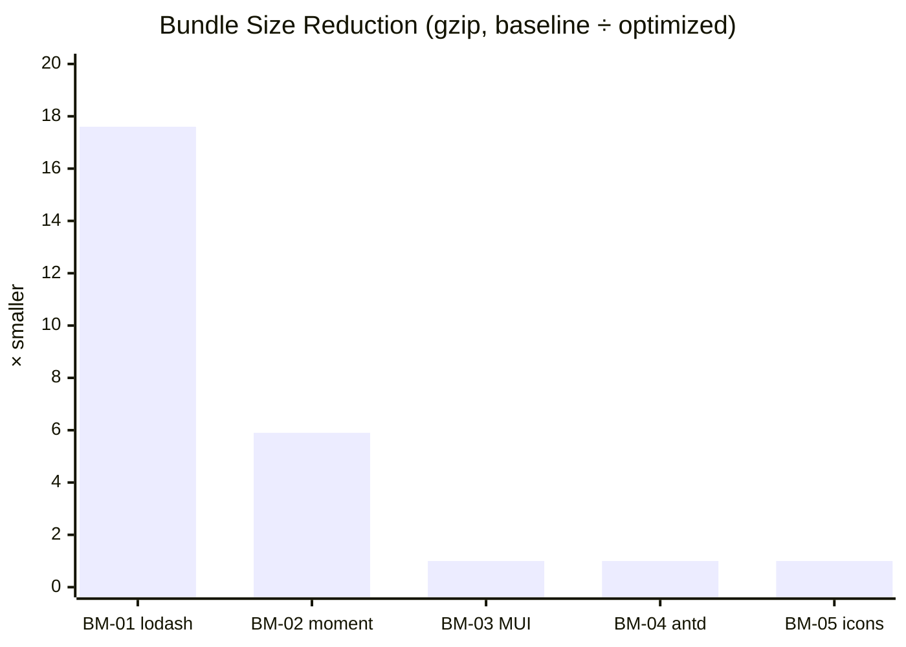
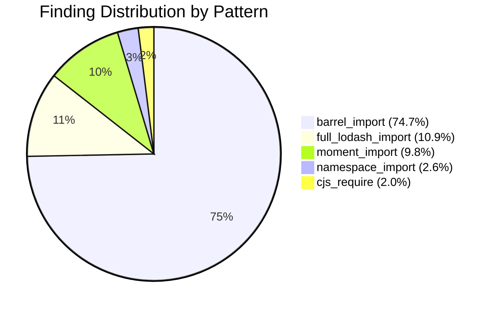

# I Benchmarked Five Bundle Bloat Patterns and Scanned 500 Repos. Only Two Actually Matter.

There's a piece of advice that circulates through every frontend team eventually: don't use barrel imports. They kill tree-shaking. They inflate your bundle. Use direct path imports instead.

I've given that advice. You've probably given it too. But I'd never actually measured it.

So I set up five controlled benchmarks — the five most commonly cited bundle bloat anti-patterns — and ran each through esbuild with `--bundle --minify`. Then I pointed a Babel AST detector at 500 public frontend repositories to see how often each pattern appears in real code.

The short version: two of the five patterns are genuinely devastating. `import _ from 'lodash'` ships 17.6× more code than the tree-shakeable alternative. `import moment from 'moment'` ships 5.9× more than dayjs. But the other three — barrel imports from MUI, barrel imports from antd, namespace imports from react-icons — produced *identical* bundles. Zero difference. The pattern that everyone warns about the most had no measurable impact with a modern bundler.

Here's the full breakdown.

> **15-minute action plan for engineering leads:** Run `grep -rn "from 'lodash'" src/ --include="*.ts" --include="*.tsx" --include="*.js" --include="*.jsx" | grep -v lodash-es | grep -v node_modules` on your frontend codebase. Every hit is shipping 25 KB of dead code. Then grep for `from 'moment'` — each one costs 17 KB over dayjs. These two patterns account for all the high-severity findings in this study. The fix is a dependency swap and a find-replace. Don't waste time converting `import { Button } from '@mui/material'` to path imports — with any modern bundler, they produce the same output.

---

## What "bundle bloat" actually means

When you `import _ from 'lodash'`, your bundler sees a default import of the entire library. Lodash's CommonJS build doesn't support tree-shaking — every function in the library ends up in your production bundle, even if you only use `debounce`. That's 74 KB raw, 27 KB gzipped, for a single utility function.

The tree-shakeable alternative — `import { debounce } from 'lodash-es'` — uses ES module named exports. The bundler can statically analyze which exports are referenced and drop everything else. Same function, fraction of the code.

Barrel imports work differently. When you write `import { Button } from '@mui/material'`, you're importing from an index file that re-exports hundreds of components. The *theory* is that the bundler pulls in everything from that index file. The *practice* depends entirely on whether the library marks its package with `sideEffects: false` and whether the bundler respects it.

The question isn't whether these patterns *can* cause bloat. It's whether they *do*, with the tools people actually use today.

---

## Part 1: What does each pattern actually cost?

### The setup

I created minimal entry-point files for five benchmark scenarios. Each has a "baseline" (the anti-pattern) and an "optimized" alternative. Both use the same functionality — same components, same functions, same output.

The runner installs the required packages in an isolated temp directory, bundles each entry point with esbuild (`--bundle --minify --platform=browser --format=esm`), and measures raw bytes and gzip-compressed bytes of the output.

**Environment:** Node.js v24, esbuild 0.25, Windows x64.

### BM-01: lodash — full default import vs lodash-es named import

The anti-pattern everyone knows about. Import the entire library vs import just what you use.

```javascript
// Baseline (anti-pattern)
import _ from 'lodash';
export const fn = () => _.debounce(() => {}, 300);

// Optimized
import { debounce } from 'lodash-es';
export const fn = () => debounce(() => {}, 300);
```

| Metric | Baseline | Optimized | Ratio |
|--------|----------|-----------|-------|
| **Raw bytes** | 73,850 | 3,191 | **23.1×** |
| **Gzip bytes** | 26,825 | 1,526 | **17.6×** |
| **Savings** | — | — | **25.3 KB gzip** |

The entire lodash library, minified and gzipped, is 26.8 KB. The tree-shaken `debounce` import is 1.5 KB. That's a 17.6× difference for a one-line change.

This isn't a bundler limitation — it's a library design issue. Lodash's default CJS build has no ES module exports for the bundler to analyze. `lodash-es` is the same code restructured as ES modules. The bundler does the rest.

### BM-02: moment.js vs dayjs vs date-fns

Moment.js is the textbook example of a non-tree-shakeable monolith. It ships its entire API surface plus locale data in a single bundle.

```javascript
// Baseline
import moment from 'moment';
export const fn = () => moment().format('YYYY-MM-DD');

// Optimized (dayjs)
import dayjs from 'dayjs';
export const fn = () => dayjs().format('YYYY-MM-DD');

// Optimized (date-fns)
import { format } from 'date-fns';
export const fn = () => format(new Date(), 'yyyy-MM-dd');
```

| Library | Raw bytes | Gzip bytes | vs moment |
|---------|-----------|------------|-----------|
| **moment** | 61,987 | 20,165 | — |
| **dayjs** | 7,827 | 3,410 | **5.9× smaller** |
| **date-fns** | 20,103 | 5,857 | **3.4× smaller** |

dayjs is the clear winner at 3.4 KB gzipped — a 16.8 KB savings over moment. date-fns is also a significant improvement at 5.9 KB, though its tree-shaken output is larger than dayjs because `format` pulls in more internal dependencies (locale handling, date parsing).

Both are drop-in replacements for the most common moment operations. dayjs even matches moment's API surface intentionally.

### BM-03: @mui/material — barrel import vs direct path import

This is where the conventional wisdom breaks down.

```javascript
// Baseline (barrel import)
import { Button, TextField, Box } from '@mui/material';
export { Button, TextField, Box };

// Optimized (direct path import)
import Button from '@mui/material/Button';
import TextField from '@mui/material/TextField';
import Box from '@mui/material/Box';
export { Button, TextField, Box };
```

| Metric | Barrel import | Direct path | Ratio |
|--------|---------------|-------------|-------|
| **Raw bytes** | 205,929 | 205,709 | 1.00× |
| **Gzip bytes** | 65,426 | 65,676 | **1.00×** |
| **Savings** | — | — | **−0.2 KB** |

**No difference.** The barrel import actually produced a marginally *smaller* gzip output than the direct path import (by 250 bytes — well within noise). The bundles are functionally identical.

MUI v5+ ships with `sideEffects: false` in its `package.json` and provides proper ES module exports. esbuild reads that flag and tree-shakes the barrel import down to exactly the referenced components. The advice to use direct path imports for MUI is outdated — it mattered with webpack 4, but modern bundlers handle it correctly.

### BM-04: antd — barrel import vs deep import

Same test, different component library.

```javascript
// Baseline (barrel import)
import { Button } from 'antd';
export { Button };

// Optimized (deep import)
import Button from 'antd/es/button';
export { Button };
```

| Metric | Barrel import | Deep import | Ratio |
|--------|---------------|-------------|-------|
| **Raw bytes** | 840,191 | 840,191 | 1.00× |
| **Gzip bytes** | 271,976 | 273,252 | **1.00×** |
| **Savings** | — | — | **−1.2 KB** |

**Identical again.** antd's barrel import and deep import produce the same bundle size with esbuild. The barrel import is actually 1.2 KB *smaller* in gzip — likely because the barrel re-export allows esbuild to deduplicate some shared internal modules more efficiently.

Both outputs are large (272 KB gzip) because even a single antd Button pulls in antd's entire styling system, animation library, and utility layer. That's a real cost, but it's not caused by the *import pattern* — it's the library's dependency graph.

### BM-05: react-icons — namespace import vs named import

```javascript
// Baseline (namespace import)
import * as Icons from 'react-icons/fa';
export const icon = Icons.FaHome;

// Optimized (named import)
import { FaHome } from 'react-icons/fa';
export const icon = FaHome;
```

| Metric | Namespace import | Named import | Ratio |
|--------|-----------------|--------------|-------|
| **Raw bytes** | 11,918 | 11,918 | 1.00× |
| **Gzip bytes** | 4,699 | 4,700 | **1.00×** |
| **Savings** | — | — | **0 KB** |

**Byte-for-byte identical.** esbuild analyzes the namespace import, sees that only `FaHome` is accessed via `Icons.FaHome`, and tree-shakes everything else. The `import *` pattern does *not* prevent tree-shaking in a modern bundler — it's a myth that persists from the webpack 3 era.

### The summary table

| Module | Library | Baseline (gzip) | Optimized (gzip) | Ratio | Savings |
|--------|---------|-----------------|-------------------|-------|---------|
| BM-01 | lodash | 26.8 KB | 1.5 KB | **17.6×** | **25.3 KB** |
| BM-02 | moment → dayjs | 20.2 KB | 3.4 KB | **5.9×** | **16.8 KB** |
| BM-03 | @mui/material | 65.4 KB | 65.7 KB | 1.00× | **0 KB** |
| BM-04 | antd | 272.0 KB | 273.3 KB | 1.00× | **0 KB** |
| BM-05 | react-icons | 4.7 KB | 4.7 KB | 1.00× | **0 KB** |



> BM-01 and BM-02 dominate. The other three produce identical bundles regardless of import style. The conventional advice to avoid barrel imports is, with esbuild at least, no longer accurate.

The pattern is clear: **the problem isn't how you import — it's what you import.** lodash and moment are non-tree-shakeable by design. No bundler can fix that. MUI, antd, and react-icons are tree-shakeable, and modern bundlers handle them correctly regardless of whether you use barrel imports, direct paths, or namespace imports.

---

## Part 2: How common are these patterns in the wild?

### How I ran the scan

I built a Babel AST detector that parses JavaScript and TypeScript files, walks the import declarations, and flags five patterns:

| Pattern | What it catches | Severity |
|---------|----------------|----------|
| `full_lodash_import` | `import _ from 'lodash'` or `require('lodash')` | High |
| `moment_import` | `import moment from 'moment'` or `require('moment')` | High |
| `barrel_import` | `import { X } from '@mui/material'` and similar barrel re-exports | Medium |
| `namespace_import` | `import * as X from 'library'` | Medium |
| `cjs_require` | `require('lodash')` or `require('moment')` in ESM-targeted source | Medium |

Severity is assigned based on the benchmark results: high for patterns with proven bundle size impact (lodash, moment), medium for patterns that *could* impact size depending on bundler configuration.

I ran this against 500 frontend repositories — React, Vue, and Angular projects across 8 domains: UI component libraries, SaaS applications, developer tools, data visualization, e-commerce/CMS, state management, and mobile/cross-platform apps.

### The numbers

**17,594 findings across 106 repositories. 21.2% of the corpus had at least one anti-pattern.**

Here's how the patterns break down:

| Pattern | Count | Share | Benchmark impact |
|---------|-------|-------|-----------------|
| `barrel_import` | 13,142 | 74.7% | None (BM-03/04) |
| `full_lodash_import` | 1,913 | 10.9% | **17.6× bloat** (BM-01) |
| `moment_import` | 1,724 | 9.8% | **5.9× bloat** (BM-02) |
| `namespace_import` | 466 | 2.6% | None (BM-05) |
| `cjs_require` | 349 | 2.0% | Depends on library |



The most common pattern — barrel imports — is the one that doesn't matter. Nearly three-quarters of all findings are medium-severity patterns that, based on the benchmarks, produce no measurable bundle size increase with a modern bundler.

The patterns that *do* matter — full lodash imports and moment.js imports — account for 20.7% of findings. That's 3,637 instances of genuinely impactful bundle bloat across the corpus.

### By severity

| Severity | Count | What it means |
|----------|-------|---------------|
| **High** | 3,637 | lodash or moment — confirmed impact |
| **Medium** | 13,957 | Barrel/namespace/CJS — bundler-dependent, likely zero impact |

All 3,637 high-severity findings correspond to the two patterns (lodash, moment) that showed real bundle size impact in the benchmarks. The 13,957 medium findings are patterns that were historically problematic but that modern bundlers handle correctly.

### The biggest offenders

| Repository | Findings | Domain |
|------------|---------|--------|
| mantinedev/mantine | 1,876 | UI component library |
| ant-design/ant-design | 1,826 | UI component library |
| elastic/kibana | 1,541 | Data visualization |
| chakra-ui/chakra-ui | 1,485 | UI component library |
| refinedev/refine | 1,247 | Admin framework |
| Semantic-Org/Semantic-UI-React | 1,216 | UI component library |
| signoz/signoz | 1,063 | Observability |
| metabase/metabase | 783 | Data analytics |
| grommet/grommet | 533 | UI component library |
| openreplay/openreplay | 484 | Session replay |

The top 10 repositories account for **12,054 findings — 68.5% of the total**. The distribution is heavily right-skewed, and the top offenders are overwhelmingly UI component libraries.

This makes sense. Mantine, ant-design, chakra-ui, semantic-ui, and grommet are *themselves* UI component libraries. Their source code is full of barrel imports because that's how the library exposes its API to consumers. These are internal imports within the library's own source — not consumer application code importing the library.

That context matters. A barrel import *inside* Mantine's source tree is part of the library's build pipeline, not an anti-pattern in someone's production application. The high finding counts for these repos are more a reflection of library architecture than of developer mistakes.

The more interesting entries are the application-level repos already in the top 10 — signoz (1,063), metabase (783), openreplay (484) — plus ToolJet (329) and cypress (342) further down the list. These are actual applications where the import patterns directly affect production bundle size.

### What the high-severity findings tell us

Let's focus on just the patterns that matter — the 1,913 lodash and 1,724 moment.js imports.

If every full lodash import adds 25.3 KB of dead weight, and every moment.js import costs 16.8 KB over dayjs, the theoretical maximum savings across the corpus is:

- **lodash**: 1,913 × 25.3 KB = **48.4 MB** potential reduction
- **moment**: 1,724 × 16.8 KB = **29.0 MB** potential reduction
- **Total**: **77.4 MB** of unnecessary code across 500 repositories

That's a theoretical upper bound — many of those instances are in test files, examples, or build scripts where bundle size doesn't matter. But for the instances that end up in production bundles, each one is a measurable cost to every user on every page load.

---

## The inversion: the most warned-about pattern matters least

Here's what I didn't expect going into this study.

The frontend community has spent years telling developers to avoid barrel imports. Blog posts, ESLint rules, conference talks — all focused on `import { Button } from '@mui/material'` as the canonical example of bundle bloat. It's the pattern everyone knows about.

And it's the pattern that doesn't matter. At least not with esbuild, and likely not with modern webpack or Vite either.

Meanwhile, `import _ from 'lodash'` — a pattern that many developers use without thinking twice — ships 25 KB of dead code on every page load. `import moment from 'moment'` costs 17 KB more than dayjs on every page load. These are the patterns that actually move the needle, and they get far less attention.

The reason is historical. Barrel imports *were* problematic with webpack 3 and 4, which struggled to tree-shake re-exports from index files. The advice was correct in 2018. But bundlers evolved — esbuild, Rollup, webpack 5, and Vite all handle barrel imports correctly when the library provides `sideEffects: false` and ES module exports.

lodash and moment didn't evolve. lodash's default package is still CommonJS. moment is still a non-tree-shakeable monolith. The fix requires switching to a different package (`lodash-es`, `dayjs`), not just changing your import syntax.

---

## How to find this in your own code

Three approaches, from fastest to most thorough.

**grep for the high-impact patterns.** These two commands find the patterns that actually cost bundle size:

```bash
# Find full lodash imports (25.3 KB each)
grep -rn "from 'lodash'" src/ --include="*.ts" --include="*.tsx" --include="*.js" --include="*.jsx" | grep -v lodash-es | grep -v node_modules

# Find moment.js imports (16.8 KB over dayjs)
grep -rn "from 'moment'" src/ --include="*.ts" --include="*.tsx" --include="*.js" --include="*.jsx" | grep -v node_modules
```

**Use a bundle analyzer.** Tools like [rollup-plugin-visualizer](https://github.com/btd/rollup-plugin-visualizer) or [webpack-bundle-analyzer](https://github.com/webpack-contrib/webpack-bundle-analyzer) show you exactly what's in your production bundle. Look for large single-library blocks — lodash will show up as a ~70 KB chunk, moment as a ~60 KB chunk.

**Use static analysis.** The AST-based detector from this study scans your source files and flags each pattern with severity and location. It catches patterns that bundle analyzers miss — like a lodash import buried in a utility file that only runs on certain code paths.

---

## The fixes

### lodash → lodash-es

```bash
npm uninstall lodash
npm install lodash-es
npm install -D @types/lodash-es  # if using TypeScript
```

```typescript
// Before — ships 26.8 KB gzipped
import _ from 'lodash';
const debouncedFn = _.debounce(handler, 300);

// After — ships 1.5 KB gzipped
import { debounce } from 'lodash-es';
const debouncedFn = debounce(handler, 300);
```

If you're only using one or two lodash functions, consider whether you need lodash at all. `debounce`, `throttle`, `cloneDeep` — many have native or lightweight alternatives.

### moment.js → dayjs

```bash
npm uninstall moment
npm install dayjs
```

```typescript
// Before — ships 20.2 KB gzipped
import moment from 'moment';
const formatted = moment().format('YYYY-MM-DD');
const diff = moment(end).diff(moment(start), 'days');

// After — ships 3.4 KB gzipped
import dayjs from 'dayjs';
const formatted = dayjs().format('YYYY-MM-DD');
const diff = dayjs(end).diff(dayjs(start), 'day');
```

dayjs matches moment's API surface intentionally. Most code migrates with a find-replace. For advanced features (timezone, relative time, custom parsing), dayjs uses plugins that you import individually — keeping the base bundle small.

**date-fns** is also a solid alternative at 5.9 KB gzipped — a 14.3 KB saving over moment. Its `format` function uses a different syntax (`yyyy-MM-dd` instead of `YYYY-MM-DD`), so the migration isn't pure find-replace. I recommend dayjs as the default choice for moment replacements; reach for date-fns if you prefer its functional, tree-shakeable-by-design API.

### Barrel imports — leave them alone

```typescript
// This is fine. Don't change it.
import { Button, TextField, Box } from '@mui/material';

// This is also fine. Equivalent output.
import Button from '@mui/material/Button';
```

If your bundler is esbuild, Vite, Rollup, or webpack 5 — and the library provides `sideEffects: false` — barrel imports produce identical bundles to direct path imports. Save your refactoring time for patterns that actually matter.

---

## Honest caveats

**The benchmarks used esbuild only.** Results may differ with older bundlers. webpack 4 and earlier had genuine issues with barrel imports and namespace imports. If you're still on webpack 4, the barrel import advice might still apply to your project. The MUI and antd benchmarks specifically test the case where `sideEffects: false` is present and the bundler respects it.

**The scan's effective coverage is lower than 500.** Approximately 200 corpus repos couldn't be cloned (renamed, archived, or deleted since corpus construction). The 21.2% prevalence rate uses 500 as the denominator — the effective rate among successfully scanned repos is likely closer to 35%. I've kept the conservative figure.

**Finding counts ≠ bundle impact counts.** A barrel import finding in Mantine's source tree doesn't mean someone's production app is bloated. Many findings are in library source code, test files, examples, and documentation. The detector doesn't filter by whether the code ends up in a production bundle — only whether the import pattern matches.

**The detector has false positives for barrel imports.** Not every `import { X } from 'library'` is a barrel import — some libraries export from a small index file with only a few modules. The detector flags them all and lets severity classification sort them out. The high-severity patterns (lodash, moment) have near-zero false positives because they're unambiguous.

**Library-level vs application-level impact differs.** The top-10 repos are mostly UI component libraries. Their high finding counts reflect library architecture, not application-level mistakes. Application repos like signoz, metabase, and ToolJet are more representative of real-world impact.

**antd's large base size masks import pattern effects.** Both antd import styles produce a 272 KB gzip bundle because antd's component architecture pulls in heavy shared dependencies (styling, animation, utilities) regardless of how you import. The import pattern isn't the problem — the library's dependency graph is.

---

## What this means for your codebase

If you're running a frontend application:

1. **Check for lodash and moment.js first.** These are the only two patterns with confirmed, large bundle size impact. A single lodash import costs 25 KB. A single moment import costs 17 KB over dayjs. Fix these before anything else.
2. **Stop converting barrel imports to path imports.** If your bundler is modern (esbuild, Vite, webpack 5), this refactoring produces zero savings. The time is better spent on actual optimization work.
3. **Monitor your actual bundle size.** Static analysis finds the patterns; bundle analyzers show the impact. Use both. A barrel import in test code doesn't matter. A lodash import in your main entry point does.
4. **Update your team's linting rules.** If you have ESLint rules that enforce direct path imports for MUI or antd, consider relaxing them. They're adding friction without adding value. Add rules for full lodash imports and moment.js instead.

The 21.2% prevalence number says that roughly one in five frontend repos has at least one bundle bloat pattern. But the benchmark data shows that most of those findings are harmless with modern tooling. The 20.7% of findings flagged as high-severity — lodash and moment imports — is where the real savings live.

Two dependency swaps. That's it. `lodash` → `lodash-es` and `moment` → `dayjs`. Everything else is noise.

---

## Appendix: source code and data reference

All code, data, and results are in the [empirical-study](https://github.com/liangk/empirical-study) repository.

### Static analysis (Step 3)

| File | What it does |
|------|-------------|
| [`src/step3-static-analysis/detector/bundle-bloat-detector.ts`](https://github.com/liangk/empirical-study/blob/main/studies/07-bundle-bloat/src/step3-static-analysis/detector/bundle-bloat-detector.ts) | Babel AST detector — import pattern matching, severity classification |

### Benchmarks (Step 1)

| File | What it does |
|------|-------------|
| [`src/step1-benchmarks/run-all.ts`](https://github.com/liangk/empirical-study/blob/main/studies/07-bundle-bloat/src/step1-benchmarks/run-all.ts) | Benchmark orchestrator — esbuild bundling, size measurement, gzip compression |
| [`src/step1-benchmarks/fixtures/`](https://github.com/liangk/empirical-study/tree/main/studies/07-bundle-bloat/src/step1-benchmarks/fixtures) | Minimal entry points for each benchmark scenario |

### Corpus scan (Step 2)

| File | What it does |
|------|-------------|
| [`src/step2-realworld/scanner.ts`](https://github.com/liangk/empirical-study/blob/main/studies/07-bundle-bloat/src/step2-realworld/scanner.ts) | Repo cloning, file collection, scan orchestration |
| [`src/step2-realworld/corpus.ts`](https://github.com/liangk/empirical-study/blob/main/studies/07-bundle-bloat/src/step2-realworld/corpus.ts) | Corpus parser — reads markdown table into structured repo list |
| [`data/corpus.md`](https://github.com/liangk/empirical-study/blob/main/studies/07-bundle-bloat/data/corpus.md) | 500 frontend repositories across 8 domains |

### Result data

| File | Contents |
|------|----------|
| `results/bench-*.json` | Per-module bundle size measurements (raw + gzip) |
| `results/findings-*.json` | Raw scan findings (per-file, per-import) |
| `results/prevalence-*.json` | Aggregated pattern counts, severity breakdown, per-repo totals |
| `results/scan-errors-*.json` | Repos that failed to clone |

---

*Built at [Stack Insight](https://stackinsight.dev).*
