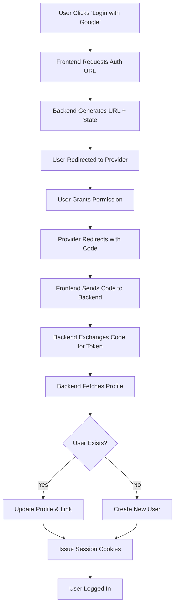

# Mastering OAuth: Google, GitHub, & Twitter in Node.js + Angular

*A complete production guide to unified social login, account linking, and PKCE security*

**Last updated**: December 2025 | Angular 20.2+ | Node.js 20

> 💡 **Note**: This guide implements a robust, unified OAuth system. For a complete, production-ready authentication starter that includes this OAuth implementation along with email/password auth, check out [StackInsight Auth Pro](https://stackinsight.app).

---

Building a modern authentication system? Your users expect the convenience of "Continue with Google" or "Continue with GitHub." But implementing multiple providers while keeping your codebase clean can be a nightmare of spaghetti code.

In this guide, we'll build a **unified, production-grade OAuth system** for a Node.js + Angular application. We're not just hacking together a login button; we're building a robust architecture that handles:

*   **Multiple Providers:** Google, GitHub, and Twitter (with PKCE).
*   **Account Linking:** Smartly merging accounts based on email addresses.
*   **Security:** State parameters, PKCE, and secure session cookies.
*   **Extensibility:** A pattern that makes adding Facebook or LinkedIn trivial.

**By the end of this tutorial, you'll have a complete, secure social login flow that you can drop into any project.**

---

## The Architecture: The Map

Before we write a single line of code, let's understand the flow. We're using the **Authorization Code Flow**, which is the gold standard for security.

Here is how our Frontend (Angular) and Backend (Node.js) will dance together:



### Why This Architecture?
1.  **Secrets Stay Safe:** Your Client Secrets never leave the backend.
2.  **Unified Logic:** All providers feed into a single "Upsert User" function.
3.  **Frontend Agnostic:** The frontend just handles redirects; the heavy lifting happens on the server.

---

## Prerequisites & Setup

To follow along, you'll need:
*   **Node.js 18+** and **PostgreSQL**.
*   **Angular 17+** (we're using Angular 20 features).
*   **Developer Accounts** for Google, GitHub, and Twitter to get your `Client ID` and `Client Secret`.

### 1. Install Dependencies

First, let's equip our backend with the necessary tools:

```bash
# Backend folder
npm install @prisma/client express cookie-parser cors jsonwebtoken
npm install -D @types/express @types/jsonwebtoken
```

For the frontend, we'll rely on Angular's native `HttpClient`—no extra bloat needed!

### 2. Configure Environment Variables

Create a `.env` file in your backend. **Never commit this file!**

```bash
# Frontend URL (for redirects)
FRONTEND_URL=http://localhost:4200

# Google
GOOGLE_CLIENT_ID=your_google_id
GOOGLE_CLIENT_SECRET=your_google_secret
GOOGLE_REDIRECT_URI=http://localhost:4000/api/auth/social-login
GOOGLE_OAUTH_SCOPES=openid email profile

# GitHub
GITHUB_CLIENT_ID=your_github_id
GITHUB_CLIENT_SECRET=your_github_secret
GITHUB_REDIRECT_URI=http://localhost:4000/api/auth/social-login
GITHUB_OAUTH_SCOPES=read:user user:email

# Twitter (OAuth 2.0)
TWITTER_CLIENT_ID=your_twitter_id
TWITTER_CLIENT_SECRET=your_twitter_secret
TWITTER_REDIRECT_URI=http://localhost:4000/api/auth/social-login
TWITTER_OAUTH_SCOPES=tweet.read users.read offline.access
```

> **Pro Tip:** Your callback URL (`REDIRECT_URI`) must match *exactly* what you set in the provider's dashboard, including the port and path.

---

## Part 1: The Database Schema

We need to track which provider a user used and store their unique provider IDs. We'll use **Prisma** for our schema.

Add these fields to your `User` model in `schema.prisma`:

```prisma
model User {
  id            String    @id @default(cuid())
  email         String    @unique
  password      String?   // Nullable: OAuth users might not have a password
  name          String?
  avatarUrl     String?
  emailVerified Boolean   @default(false)
  
  // OAuth Tracking
  authProvider  String?   // 'google', 'github', 'twitter'
  googleId      String?   @unique
  githubId      String?   @unique
  twitterId     String?   @unique
  
  createdAt     DateTime  @default(now())
  updatedAt     DateTime  @updatedAt
}
```

**Why separate IDs?**
Storing `googleId` and `githubId` separately allows a single user to link *both* accounts to one profile. If we just had a generic `providerId` field, a user couldn't link multiple providers.

---

## Part 2: Centralized Configuration

Hardcoding credentials is a recipe for disaster. Let's create a type-safe configuration system.

Create `src/config/socialProviders.ts`:

```typescript
type BaseConfig = {
  clientId: string;
  clientSecret: string;
  redirectUri: string;
  scopes: string[];
};

function ensure(value: string | undefined, key: string): string {
  if (!value) throw new Error(`Missing config for ${key}`);
  return value;
}

export function resolveGoogleConfig(): BaseConfig {
  return {
    clientId: ensure(process.env.GOOGLE_CLIENT_ID, 'GOOGLE_CLIENT_ID'),
    clientSecret: ensure(process.env.GOOGLE_CLIENT_SECRET, 'GOOGLE_CLIENT_SECRET'),
    redirectUri: ensure(process.env.GOOGLE_REDIRECT_URI, 'GOOGLE_REDIRECT_URI'),
    scopes: (process.env.GOOGLE_OAUTH_SCOPES || 'openid email profile').split(' '),
  };
}
// Repeat for GitHub and Twitter...
```

This ensures your app **fails fast** at startup if keys are missing, rather than crashing when a user tries to log in.

---

## Part 3: The Core Service Layer

This is where the magic happens. We need a service that can:
1.  Generate authorization URLs.
2.  Exchange codes for tokens.
3.  Fetch user profiles.
4.  Standardize the data.

### The Standardized Profile
First, let's define what a "Social Profile" looks like, regardless of whether it came from Google or Twitter.

```typescript
type SocialProfile = {
  provider: 'google' | 'github' | 'twitter';
  providerId: string;
  email?: string;
  name?: string;
  avatarUrl?: string;
};
```

### Implementing Google OAuth
```typescript
// src/services/socialAuthService.ts

export async function handleGoogleCallback(code: string): Promise<User> {
  const { clientId, clientSecret, redirectUri } = resolveGoogleConfig();

  // 1. Exchange code for token
  const tokenParams = new URLSearchParams({
    code,
    client_id: clientId,
    client_secret: clientSecret,
    redirect_uri: redirectUri,
    grant_type: 'authorization_code',
  });
  
  const tokenRes = await fetch('https://oauth2.googleapis.com/token', {
    method: 'POST',
    body: tokenParams,
  });
  
  if (!tokenRes.ok) throw new Error('Google token exchange failed');
  const { access_token } = await tokenRes.json();

  // 2. Fetch Profile
  const userRes = await fetch('https://www.googleapis.com/oauth2/v3/userinfo', {
    headers: { Authorization: `Bearer ${access_token}` },
  });
  const profileJson = await userRes.json();

  // 3. Normalize
  const profile: SocialProfile = {
    provider: 'google',
    providerId: profileJson.sub,
    email: profileJson.email,
    name: profileJson.name,
    avatarUrl: profileJson.picture,
  };

  return upsertUserFromProfile(profile);
}
```

### Implementing Twitter (The Tricky One: PKCE)
Twitter requires **PKCE** (Proof Key for Code Exchange), which adds a layer of security. We need to generate a "Code Verifier" and "Code Challenge".

```typescript
// Simplified PKCE flow
export function getTwitterAuthorizationUrl() {
  const { clientId, redirectUri, scopes } = resolveTwitterConfig();
  
  // Generate random verifier & challenge
  const codeVerifier = randomBytes(32).toString('base64url');
  const codeChallenge = createHash('sha256').update(codeVerifier).digest('base64url');
  
  // Store verifier in memory/redis with a state ID
  const stateId = randomUUID();
  storeVerifier(stateId, codeVerifier); 

  const params = new URLSearchParams({
    response_type: 'code',
    client_id: clientId,
    redirect_uri: redirectUri,
    scope: scopes.join(' '),
    state: `twitter:${stateId}`,
    code_challenge: codeChallenge,
    code_challenge_method: 'S256',
  });

  return `https://twitter.com/i/oauth2/authorize?${params.toString()}`;
}
```
*Note: In production, store your PKCE verifiers in Redis or a secure HTTP-only cookie, not just in-memory.*

---

## Part 4: Smart Account Linking

The most critical part of this system is the `upsertUserFromProfile` function. We don't want to create duplicate accounts if a user logs in with Google one day and GitHub the next, provided they share an email.

```typescript
async function upsertUserFromProfile(profile: SocialProfile) {
  // 1. Check if user exists by Provider ID (The "Login" case)
  const providerField = `${profile.provider}Id`;
  let user = await prisma.user.findUnique({
    where: { [providerField]: profile.providerId }
  });

  if (user) return user;

  // 2. Check if user exists by Email (The "Linking" case)
  if (profile.email) {
    user = await prisma.user.findUnique({
      where: { email: profile.email }
    });
    
    if (user) {
      // Link the new provider to the existing account
      return prisma.user.update({
        where: { id: user.id },
        data: { [providerField]: profile.providerId }
      });
    }
  }

  // 3. Create New User (The "Signup" case)
  return prisma.user.create({
    data: {
      email: profile.email!,
      name: profile.name,
      avatarUrl: profile.avatarUrl,
      [providerField]: profile.providerId,
      authProvider: profile.provider,
    }
  });
}
```

---

## Part 5: Wiring it Up (Controller & Routes)

Now, let's expose this logic to our frontend via Express.

### The Controller

```typescript
// src/controllers/socialAuthController.ts
export async function socialLogin(req: Request, res: Response) {
  const { provider, code, state } = req.body;
  
  try {
    let user;
    if (provider === 'google') user = await handleGoogleCallback(code);
    else if (provider === 'github') user = await handleGithubCallback(code);
    else if (provider === 'twitter') user = await handleTwitterCallback(code, state);
    
    // Issue session cookies (HttpOnly)
    const token = signAccessToken(user.id);
    res.cookie('token', token, { httpOnly: true, secure: true });
    
    res.json({ user });
  } catch (err) {
    res.status(400).json({ message: 'Login failed', error: err.message });
  }
}
```

### The Routes

```typescript
// src/routes/socialAuthRoutes.ts
const router = Router();

router.get('/google', (req, res) => res.json({ url: getGoogleAuthorizationUrl() }));
router.get('/github', (req, res) => res.json({ url: getGithubAuthorizationUrl() }));

// The endpoint the frontend calls after the redirect
router.post('/social-login', socialLogin);

export default router;
```

---

## Part 6: The Frontend Integration

In Angular, we want a clean UI and a robust service.

### The Login Page Template
Give your users clear, branded buttons. Using SVGs inside the buttons looks professional.

```html
<!-- login.page.html -->
<div class="login-container">
  <h2>Welcome Back</h2>
  
  <div class="social-buttons">
    <button class="social-btn google" (click)="onGoogleLogin()">
      <!-- SVG Icon for Google -->
      Continue with Google
    </button>

    <button class="social-btn github" (click)="onGithubLogin()">
      <!-- SVG Icon for GitHub -->
      Continue with GitHub
    </button>

    <button class="social-btn twitter" (click)="onTwitterLogin()">
      <!-- SVG Icon for Twitter -->
      Continue with Twitter
    </button>
  </div>
</div>
```

### The Angular Service
This service handles the initial redirect and the final code exchange.

```typescript
// auth.service.ts
@Injectable({ providedIn: 'root' })
export class AuthService {
  private http = inject(HttpClient);
  private router = inject(Router);
  
  loginWithGoogle() {
    this.http.get<{url: string}>('/api/auth/google').subscribe({
      next: ({ url }) => window.location.href = url
    });
  }

  // Called in ngOnInit of your login page
  handleCallback() {
    const params = new URLSearchParams(window.location.search);
    const code = params.get('code');
    const state = params.get('state');

    if (code) {
      // Clear the ugly URL params
      window.history.replaceState({}, '', '/login');
      
      this.http.post('/api/auth/social-login', { code, state }).subscribe({
        next: (user) => this.router.navigate(['/dashboard']),
        error: (err) => console.error('Login failed', err)
      });
    }
  }
}
```

---

## Common Pitfalls & Troubleshooting

Even with a perfect guide, things can go wrong. Here are the most common issues I've encountered:

1.  **"GitHub email is missing":**
    *   **Cause:** The user's email is private on GitHub.
    *   **Fix:** Ensure you request the `user:email` scope. If it's still null, you might need to query the `https://api.github.com/user/emails` endpoint specifically.

2.  **"Redirect URI Mismatch":**
    *   **Cause:** The URL in your code doesn't *exactly* match what you put in the Google/GitHub console.
    *   **Fix:** Check for trailing slashes (`/`) or `http` vs `https`. They must be identical.

3.  **Cookies not setting in production:**
    *   **Cause:** Cross-domain cookie policies.
    *   **Fix:** If your frontend is `app.com` and backend is `api.app.com`, you must set `SameSite: 'none'` and `Secure: true` for your cookies.

---

## Production Checklist

Before you ship this to users, ensure you have:
*   [ ] **HTTPS Enabled:** OAuth generally blocks non-HTTPS redirect URIs (except localhost).
*   [ ] **Separate Credentials:** distinct Client IDs for Development, Staging, and Production.
*   [ ] **Rate Limiting:** Protect your `/social-login` endpoint from brute-force attempts.
*   [ ] **Error Handling:** Graceful messages if a user cancels the permissions dialog.
*   [ ] **PKCE:** Ensure Twitter and other OAuth 2.0 providers are using PKCE.

## Conclusion

You now have a unified, extensible OAuth system. The beauty of this architecture is its flexibility: adding Facebook or LinkedIn next week follows the exact same pattern—add the config, add the service method, and the `upsertUserFromProfile` handles the rest.

**Resources:**
- [OAuth 2.0 RFC 6749](https://tools.ietf.org/html/rfc6749)
- [PKCE RFC 7636](https://tools.ietf.org/html/rfc7636)
- [Google OAuth Documentation](https://developers.google.com/identity/protocols/oauth2)
- [GitHub OAuth Documentation](https://docs.github.com/en/developers/apps/building-oauth-apps)
- [Twitter OAuth 2.0 Documentation](https://developer.twitter.com/en/docs/authentication/oauth-2-0)

---

> **Skip the boilerplate with StackInsight Auth Pro**  
> Want this complete OAuth implementation *and* a production-ready auth stack? **StackInsight Auth Pro** is a complete Angular 20 SSR + httpOnly cookie starter with Google, GitHub, and Twitter OAuth built in. It turns everything in this guide into a ready-to-run codebase so you can focus on your product, not the wiring.  
> Learn more at [stackinsight.app](https://stackinsight.app)

---

Happy coding!
